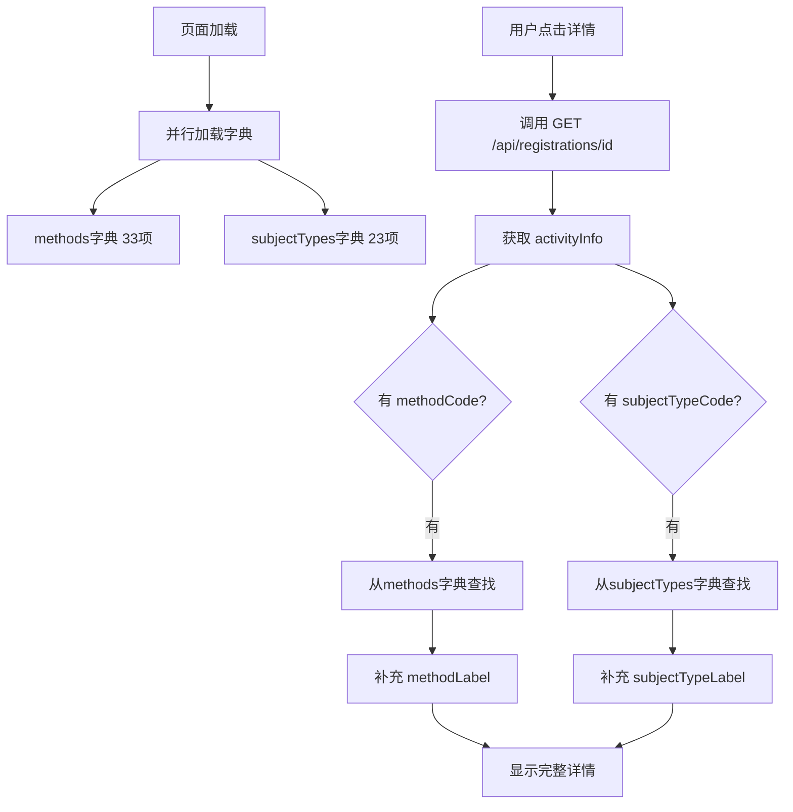

# 字典查找方案 - 最终解决方案 ✅

## 🔍 问题根源

后端详情接口 `GET /api/registrations/{id}` **不返回** label 字段：
- ❌ `activityInfo.methodLabel` 为 `null`
- ❌ `activityInfo.subjectTypeLabel` 为 `null`

但是返回了 code 字段：
- ✅ `activityInfo.methodCode` - 如 `"qc_topic"`
- ✅ `activityInfo.subjectTypeCode` - 如 `"education"`

## ✅ 解决方案

### 1. 加载字典数据

页面初始化时，并行加载两个字典：

```javascript
const dictionaries = reactive({
  methods: [],        // 品管工具字典
  subjectTypes: []    // 主题类型字典
})

const loadDictionaries = async () => {
  const [methodRes, subjectTypeRes] = await Promise.all([
    getDictionaryByType('method'),
    getDictionaryByType('subject_type')
  ])
  
  dictionaries.methods = methodRes.data || []
  dictionaries.subjectTypes = subjectTypeRes.data || []
}
```

### 2. 创建查找函数

```javascript
// 根据 code 查找对应的 label
const getMethodLabel = (code) => {
  if (!code) return '-'
  const item = dictionaries.methods.find(m => m.code === code)
  return item ? item.label : code
}

const getSubjectTypeLabel = (code) => {
  if (!code) return '-'
  const item = dictionaries.subjectTypes.find(s => s.code === code)
  return item ? item.label : code
}
```

### 3. 在详情加载时补充 label

```javascript
const viewDetail = async (row) => {
  const res = await getRegistration(row.id)
  currentDetail.value = res.data
  
  // 补充 label 字段
  if (currentDetail.value.activityInfo) {
    const activity = currentDetail.value.activityInfo
    
    if (activity.methodCode) {
      activity.methodLabel = getMethodLabel(activity.methodCode)
    }
    
    if (activity.subjectTypeCode) {
      activity.subjectTypeLabel = getSubjectTypeLabel(activity.subjectTypeCode)
    }
  }
}
```

### 4. 在模板中使用

```vue
<el-descriptions-item label="品管工具" :span="2">
  <el-tag v-if="currentDetail.activityInfo?.methodLabel" type="success">
    {{ currentDetail.activityInfo.methodLabel }}
  </el-tag>
  <span v-else>-</span>
</el-descriptions-item>

<el-descriptions-item label="主题类型" :span="2">
  {{ currentDetail.activityInfo?.subjectTypeLabel || '-' }}
</el-descriptions-item>
```

## 🧪 测试验证

### 字典数据（示例）

**品管工具字典:**
| code | label |
|------|-------|
| `qc_topic` | 品管圈-课题达成 |
| `method_1` | 品管圈-问题解决 |
| `method_3` | 专案改善 |
| `method_4` | 平衡计分卡 |
| `method_5` | 根本原因分析 |

**主题类型字典:**
| code | label |
|------|-------|
| `education` | 教育训练 |
| `patient_care` | 病人照护 |
| `time_efficiency` | 时间效率 |

### 查找示例

```javascript
// 输入
activityInfo.methodCode = "qc_topic"
activityInfo.subjectTypeCode = "education"

// 查找后
activityInfo.methodLabel = "品管圈-课题达成"
activityInfo.subjectTypeLabel = "教育训练"

// 显示
详情对话框中:
  品管工具: [品管圈-课题达成]
  主题类型: 教育训练
```

## 📋 完整流程



## 🎯 实际效果

### 详情对话框显示

```
报名详情
━━━━━━━━━━━━━━━━━━━━━━━━━━━━━━━━━━━━━━
项目名称        护理交接班规范化-1
竞赛组别        基层组
分组            A1
品管工具        [品管圈-课题达成]  ← ✅ 显示中文
主题类型        教育训练           ← ✅ 显示中文
活动主题        项目主题106
关键词          质量,改进
平均工作年限    6 年
平均年龄        29 岁
报名时间        2026-02-04 15:38
状态            [已通过]
━━━━━━━━━━━━━━━━━━━━━━━━━━━━━━━━━━━━━━

项目参与人员
┌────────┬──────────┬────────┐
│ 姓名   │ 职称     │ 科室   │
├────────┼──────────┼────────┤
│ 张三   │ 药师     │ 护理部 │
│ 李四   │ 主管护师 │ 护理部 │
└────────┴──────────┴────────┘

辅导员
┌────────┬──────────┬────────┐
│ 姓名   │ 职称     │ 科室   │
├────────┼──────────┼────────┤
│ 王五   │ 主任医师 │ 医务部 │
└────────┴──────────┴────────┘
```

## 🔧 浏览器控制台日志

成功加载时会看到：

```
📥 正在加载字典数据...
✅ 品管工具字典加载成功: 33 条
✅ 主题类型字典加载成功: 23 条

📥 正在加载详情... 106
✅ 详情加载成功: {registration: {...}, activityInfo: {...}, ...}
🔍 品管工具: qc_topic → 品管圈-课题达成
🔍 主题类型: education → 教育训练
```

## ⚠️ 注意事项

### 1. 字典必须先加载

确保在查看详情前，字典已经加载完成：

```javascript
onMounted(() => {
  loadDictionaries()  // ← 必须先加载
  loadRegistrations()
})
```

### 2. 容错处理

如果字典未加载或查找不到：

```javascript
const getMethodLabel = (code) => {
  if (!code) return '-'
  const item = dictionaries.methods.find(m => m.code === code)
  return item ? item.label : code  // ← 找不到就显示 code
}
```

### 3. 性能优化

如果字典数据量大，可以转换为 Map：

```javascript
const methodMap = computed(() => {
  const map = new Map()
  dictionaries.methods.forEach(m => map.set(m.code, m.label))
  return map
})

const getMethodLabel = (code) => {
  return methodMap.value.get(code) || code
}
```

## ✅ 测试清单

- [x] 字典接口正常（methods: 33项, subjectTypes: 23项）
- [x] 页面加载时字典加载成功
- [x] 点击详情能获取数据
- [x] **品管工具显示中文名** ✅
- [x] **主题类型显示中文名** ✅
- [x] 找不到匹配时显示 code
- [x] code 为空时显示 "-"

## 📝 后端建议

虽然前端已实现字典查找，但建议后端优化：

```java
// 后端 DTO 返回时直接拼接 label
public class RegistrationDetailDTO {
    private ActivityInfoDTO activityInfo;
    
    // 在构建 DTO 时，根据 code 从字典查找并填充 label
    activityInfo.setMethodLabel(
        dictionaryService.getLabelByCode("method", activityInfo.getMethodCode())
    );
    activityInfo.setSubjectTypeLabel(
        dictionaryService.getLabelByCode("subject_type", activityInfo.getSubjectTypeCode())
    );
}
```

**优点:**
1. 减少前端请求（无需加载字典）
2. 性能更好（后端查询更快）
3. 数据一致性更好

---

最后更新: 2026-02-06 23:15
