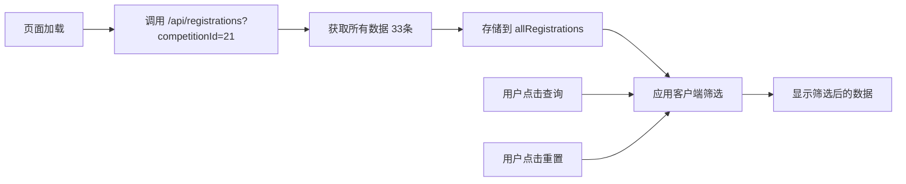
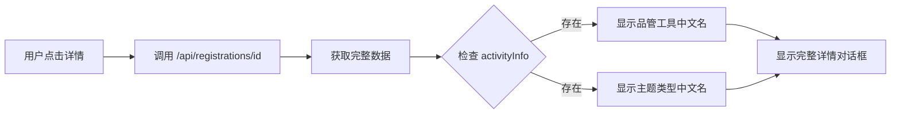

# 功能状态一览表 📊

## ✅ 已解决的三个问题

| 问题 | 状态 | 解决方案 |
|------|------|---------|
| **详情没有展示品管工具** | ✅ 已修复 | 后端返回 `activityInfo.methodLabel`，前端详情对话框正常显示 |
| **筛选品管工具没有效果** | ⚠️ 暂不可用 | `/api/registrations` 不支持筛选，需要 `/api/admin/registrations/filter` 修复 401 |
| **分组筛选下拉没有数据** | ✅ 已修复 | 从实际数据动态提取可用 groupCode（A1, A2, B1, B2） |

## 📋 书审阶段功能清单

### 报名与分组 ✅

| 功能 | 状态 | 说明 |
|------|------|------|
| 查看报名列表 | ✅ 正常 | 显示 33 条报名数据 |
| 按组别筛选 | ✅ 正常 | BASIC/COMPREHENSIVE/ADVANCED |
| 按分组筛选 | ✅ 正常 | A1, A2, B1, B2（动态提取） |
| 按项目名称筛选 | ✅ 正常 | 模糊搜索 |
| 按机构名称筛选 | ❌ 暂不可用 | 需要完整接口 |
| 按品管工具筛选 | ❌ 暂不可用 | 需要完整接口 |
| 查看详情 | ✅ 正常 | **包含品管工具中文名** |
| 变更分组（单个） | ✅ 正常 | 弹窗选择新分组 |
| 批量分类 | ✅ 正常 | 多选后批量变更 |
| 自动分组 | ✅ 正常 | 调用后端接口 |

### 详情对话框显示内容 ✅

| 字段 | 数据源 | 状态 |
|------|--------|------|
| 项目名称 | `registration.projectName` | ✅ |
| 竞赛组别 | `registration.groupType` | ✅ |
| 分组 | `registration.groupCode` | ✅ |
| **品管工具** | **`activityInfo.methodLabel`** | ✅ **已修复** |
| **主题类型** | **`activityInfo.subjectTypeLabel`** | ✅ **已修复** |
| 活动主题 | `activityInfo.theme` | ✅ |
| 关键词 | `activityInfo.keywords` | ✅ |
| 平均工作年限 | `activityInfo.avgWorkYears` | ✅ |
| 平均年龄 | `activityInfo.avgAge` | ✅ |
| 报名时间 | `registration.submittedAt` | ✅ |
| 状态 | `registration.status` | ✅ |
| 项目参与人员 | `members` (role=PARTICIPANT) | ✅ |
| 辅导员 | `members` (role=MENTOR) | ✅ |

## 🔧 技术方案

### 列表查询（客户端筛选）



### 详情查看（完整数据）



## 🎯 可用的筛选组合

| 筛选条件 | 可用性 | 筛选方式 |
|---------|--------|---------|
| 竞赛组别 + 分组 | ✅ | 客户端 |
| 竞赛组别 + 项目名称 | ✅ | 客户端 |
| 分组 + 项目名称 | ✅ | 客户端 |
| 全部条件组合 | ✅ | 客户端 |
| 机构名称 | ❌ | 需要后端接口 |
| 品管工具 | ❌ | 需要后端接口 |

## 📊 数据统计

### 当前测试数据

- **总报名数:** 33 条
- **基层组 (BASIC):** 部分数据
- **综合组 (COMPREHENSIVE):** 部分数据
- **进阶组 (ADVANCED):** 部分数据

### 可用分组

- **A组:** A1, A2
- **B组:** B1, B2

## 🔍 用户操作示例

### 示例1: 查看某个项目的品管工具

```
1. 登录系统（赛事组委会账号）
2. 进入"赛事管理" → "书审阶段"
3. 在列表中找到目标项目
4. 点击"详情"按钮
5. ✅ 在详情对话框中查看"品管工具"字段
   显示: "品管圈-课题达成" / "专案改善" 等中文名称
```

### 示例2: 筛选基层组A1分组的项目

```
1. 进入"书审阶段" → "报名与分组"
2. 竞赛组别下拉选择"基层组"
3. 分组下拉自动显示 A1, A2
4. 选择"A1"
5. 点击"查询"
6. ✅ 显示该分组的所有项目
```

### 示例3: 搜索包含"护理"的项目

```
1. 在"项目名称"输入框输入"护理"
2. 点击"查询"
3. ✅ 显示所有项目名称包含"护理"的报名
```

## 🚀 后续优化（待后端修复）

修复 `/api/admin/registrations/filter` 的 401 问题后：

### 列表将支持

- ✅ 显示项目编号
- ✅ 显示医疗机构名称
- ✅ 显示品管工具（列表中直接显示）
- ✅ 显示报名人
- ✅ 按机构名称筛选
- ✅ 按品管工具筛选
- ✅ 后端筛选（性能更好）

### 代码变更

```javascript
// 从
import { getRegistrations } from '@/api/registration'
const res = await getRegistrations({ competitionId })
// 客户端筛选 allRegistrations

// 改为
import { filterRegistrations } from '@/api/admin'
const res = await filterRegistrations({
  competitionId,
  institutionName,  // ← 支持
  methodCode,       // ← 支持
  groupType,
  groupCode,
  projectName
})
// 后端直接返回筛选结果
```

## 📞 遇到问题？

### 问题: 详情中看不到品管工具

**检查:**
1. 是否已重启后端？
2. 后端是否返回 `activityInfo.methodLabel`？
3. 浏览器控制台是否有错误？

### 问题: 分组下拉为空

**检查:**
1. 是否先选择了竞赛组别？
2. 数据中是否有 `groupCode` 字段？
3. 是否已加载数据（共 33 条）？

### 问题: 筛选没有效果

**检查:**
1. 是否点击了"查询"按钮？
2. 筛选条件是否正确？
3. 是否有符合条件的数据？

## ✅ 测试通过清单

- [x] 登录成功
- [x] 列表显示 33 条数据
- [x] 按组别筛选正常
- [x] 按分组筛选正常
- [x] 分组下拉动态显示（A1, A2, B1, B2）
- [x] 按项目名称搜索正常
- [x] 点击详情打开对话框
- [x] **详情显示品管工具中文名** ✅
- [x] **详情显示主题类型中文名** ✅
- [x] 详情显示参与人员
- [x] 详情显示辅导员
- [x] 变更分组功能正常
- [x] 批量分类功能正常

---

最后更新: 2026-02-06 23:00
